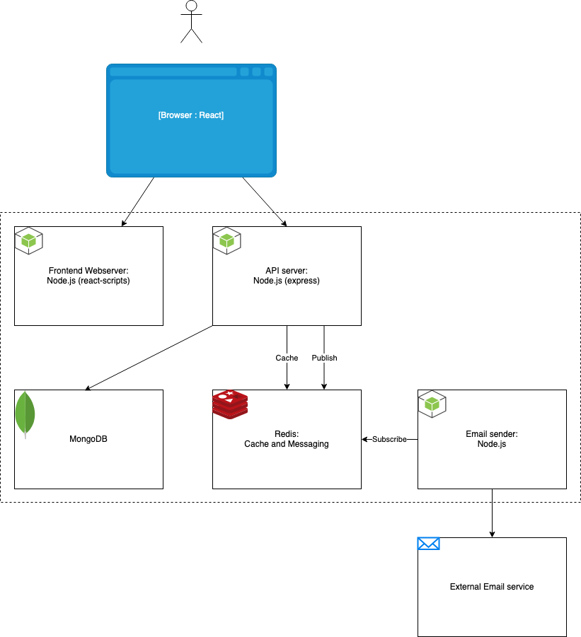

# Distributed Web Application Skeleton

This is a minimalist distributed web application skeleton, for demonstrating how various components can be implemented together: frontend, api, database, cache and pub-sub. 

This example uses Node.js, MongoDB and Redis. To run the application locally, open each component in a separate terminal window, as explained below.



## Prerequisites

* git
* node
* docker

## Database

To run MongoDB locally, open a new terminal window and run: 
```bash
docker run -p 27017:27017 -v <full local path of working directory>/mongodb-data:/data/db mongo
```
To exit, hit Ctrl-C

## Cache and Pub-Sub

To run Redis locally, open a new terminal window and run: 
```bash
docker run -p 6379:6379 redis 
```
To exit, hit Ctrl-C

## Backend API

A Node.js application listening on port 8080.

To run ther backend api server locally, open a new terminal window and run: 
```bash
cd api
npm install # first time only
npm run watch 
```

See api/test.md for testing the api with curl.

To exit, hit Ctrl-C

## Backend Email Sender

A Node.js application is listening to a redis queue, and sending fake email.

To run the email sender locally, open a new terminal window and run: 
```bash
cd email-sender
npm install # first time only
npm run watch
```
The emails will be sent to a fake address using http://ethereal.email/ service. 

To exit, hit Ctrl-C


## Frontend

React application, served by nodeJS (using react-scripts) listening on port 8000.

To run ther frontend web server locally, open a new terminal window and run: 
```bash
cd frontend
npm install # first time only
npm run watch 
```
To browse the webapp, go to http://localhost:8000

To exit, hit Ctrl-C

Frontend Code is based on https://github.com/bezkoder/react-crud-web-api .

